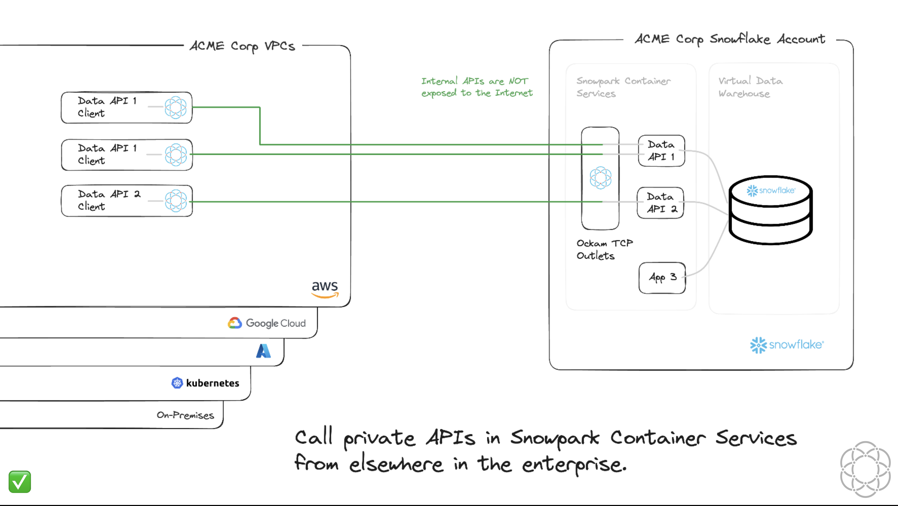

# Call private APIs in Snowpark Container Services



## Steps 1-7
- [Follow](https://quickstarts.snowflake.com/guide/build_a_custom_api_in_python/#0) Steps 1-7.

## Create the Data API in Snowpark Container Services

```sql
USE ROLE DATA_API_ROLE;

CREATE SERVICE API.PUBLIC.API
 IN COMPUTE POOL API
 FROM SPECIFICATION
$$
spec:
  container:
  - name: api
    image: /api/public/api/dataapi:latest
    resources:
      requests:
        cpu: 0.5
        memory: 128M
      limits:
        cpu: 1
        memory: 256M
  endpoint:
  - name: api
    port: 8001
    public: false
$$
QUERY_WAREHOUSE = DATA_API_WH;

CALL SYSTEM$GET_SERVICE_STATUS('api');
CALL SYSTEM$GET_SERVICE_LOGS('api.public.api', 0, 'api');

```

- Run `SHOW SERVICES;` and note down the dns_name. Should be `api.public.api.snowflakecomputing.internal`

- Push latest ockam image to image repository

```sh
docker pull ghcr.io/build-trust/ockam@sha256:d02597933622ec2fbc2c2bd8900c8ed249ea2b8cd7c7a70205b12411f8c02c37
docker tag ghcr.io/build-trust/ockam@sha256:d02597933622ec2fbc2c2bd8900c8ed249ea2b8cd7c7a70205b12411f8c02c37 <repository_url>/ockam
docker push <repository_url>/ockam
```

# Get started with Ockam

[Signup for Ockam](https://www.ockam.io/signup) and then run the following commands on your workstation:

```sh
# Install Ockam Command
curl --proto '=https' --tlsv1.2 -sSfL https://install.command.ockam.io | bash && source "$HOME/.ockam/env"

# Enroll with Ockam Orchestrator.
ockam enroll

# Create an enrollment ticket for the node that will run inside container sevices.
ockam project ticket --usage-count 1 --expires-in 1h \
  --attribute snowflake-api-service-outlet --relay snowflake-api-service > ticket

# Print the egress allow list for your Ockam project.
ockam project show --jq .egress_allow_list
```

# Create an Ockam node in Snowpark Container Services

> [!IMPORTANT]
> Replace `TODO` values in `VALUE_LIST` with the output of `ockam project show --jq .egress_allow_list` command in previous step.

```sh
#Example
VALUE_LIST = ("k8s-XXX.amazonaws.com:4XXX","k8s-XXX.amazonaws.com:4XXX");
```

> [!IMPORTANT]
> Replace `<OCKAM_ENROLLMENT_TICKET>` with contents of `ticket` generated in previous step

```sql
USE ROLE ACCOUNTADMIN;

-- Update VALUE_LIST with ockam egress details
CREATE NETWORK RULE OCKAM_OUT TYPE = 'HOST_PORT' MODE = 'EGRESS'
VALUE_LIST = ("TODO:TODO","TODO:TODO");

CREATE OR REPLACE EXTERNAL ACCESS INTEGRATION OCKAM
ALLOWED_NETWORK_RULES = (OCKAM_OUT) ENABLED = true;

GRANT USAGE ON INTEGRATION OCKAM TO ROLE DATA_API_ROLE;

USE ROLE DATA_API_ROLE;

CREATE SERVICE API_OCKAM_OUTLET
IN COMPUTE POOL API
FROM SPECIFICATION
$$
spec:
  containers:
  - name: ockam-outlet
    image: /api/public/api/ockam:latest
    args:
      - node
      - create
      - --foreground
      - --enrollment-ticket
      - "<OCKAM_ENROLLMENT_TICKET>"
      - --node-config
      - |
        relay: snowflake-api-service
        tcp-outlet:
          to: api.public.api.snowflakecomputing.internal:8001
          allow: snowflake-api-service-inlet
    env:
        OCKAM_DISABLE_UPGRADE_CHECK: true
        OCKAM_OPENTELEMETRY_EXPORT: false
$$
EXTERNAL_ACCESS_INTEGRATIONS = (OCKAM);

CALL SYSTEM$GET_SERVICE_STATUS('API_OCKAM_OUTLET');

CALL SYSTEM$GET_SERVICE_LOGS('API_OCKAM_OUTLET', '0', 'ockam-outlet', 100);

```

## Create an Ockam node next to an API Client

```sh

docker run --rm -it  \
  --name ockam-inlet \
  -p 8001:8001 \
  ghcr.io/build-trust/ockam node create --foreground \
  --enrollment-ticket "$(ockam project ticket --usage-count 1 --expires-in 1h --attribute snowflake-api-service-inlet)" \
  --node-config "
        name: api-service-inlet
        tcp-inlet:
          api-inlet:
            from: 0.0.0.0:8001
            via: snowflake-api-service
            allow: snowflake-api-service-outlet
        "
```

## Call the API

```sh
curl -X GET "http://localhost:8001/connector/customers/top10?start_range=1995-02-01&end_range=1995-02-14"
curl -X GET "http://localhost:8001/connector/clerk/000000002/yearly_sales/1995"
```

## Cleanup

```sql
USE ROLE DATA_API_ROLE;
DROP SERVICE API.PUBLIC.API;
DROP SERVICE API_OCKAM_OUTLET;

USE ROLE ACCOUNTADMIN;
DROP NETWORK RULE IF EXISTS OCKAM_OUT;
DROP INTEGRATION IF EXISTS OCKAM;
DROP COMPUTE POOL IF EXISTS API;
DROP WAREHOUSE IF EXISTS DATA_API_WH;
DROP DATABASE IF EXISTS API;
DROP ROLE IF EXISTS DATA_API_ROLE;
```
