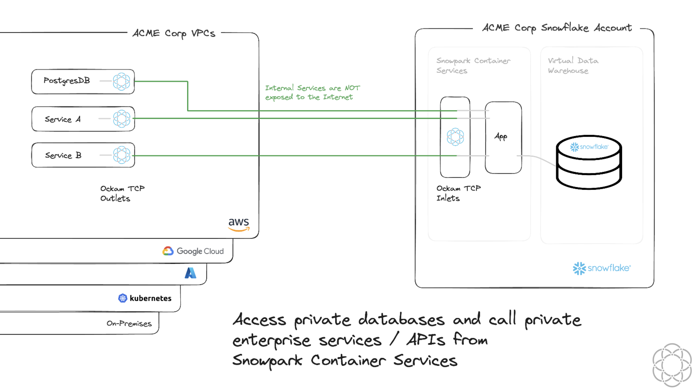

# Access private databases and call private enterprise services / API's from Snowpark Container Services



# Get started with Ockam

[Signup for Ockam](https://www.ockam.io/signup) and then run the following commands on your workstation:

```sh
# Install Ockam Command
curl --proto '=https' --tlsv1.2 -sSfL https://install.command.ockam.io | bash && source "$HOME/.ockam/env"

# Enroll with Ockam Orchestrator.
ockam enroll

# Create an enrollment ticket for the node that will run inside container sevices, next to the api_client.
ockam project ticket --usage-count 1 --expires-in 1h --attribute acme_api_client > api_client.ticket

# Note egress allow list for ockam
ockam project show --jq .egress_allow_list

# Start the API Server
pushd acme_api_service; ENROLLMENT_TICKET=$(ockam project ticket --usage-count 1 --expires-in 10m --attribute acme_api_server --relay acme_api ) docker-compose up -d; popd
```

## Setup Snowflake

```sql
USE ROLE ACCOUNTADMIN;

--Create Role
CREATE ROLE ACMECORP_ROLE;
GRANT ROLE ACMECORP_ROLE TO ROLE ACCOUNTADMIN;

--Create Database
CREATE DATABASE IF NOT EXISTS ACMECORP_DB;
GRANT OWNERSHIP ON DATABASE ACMECORP_DB TO ROLE ACMECORP_ROLE COPY CURRENT GRANTS;

USE DATABASE ACMECORP_DB;

--Create Warehouse
CREATE OR REPLACE WAREHOUSE ACMECORP_WH WITH WAREHOUSE_SIZE='X-SMALL';
GRANT USAGE ON WAREHOUSE ACMECORP_WH TO ROLE ACMECORP_ROLE;

--Create compute pool
CREATE COMPUTE POOL ACMECORP_CP
  MIN_NODES = 1
  MAX_NODES = 5
  INSTANCE_FAMILY = CPU_X64_XS;

GRANT USAGE ON COMPUTE POOL ACMECORP_CP TO ROLE ACMECORP_ROLE;
GRANT MONITOR ON COMPUTE POOL ACMECORP_CP TO ROLE ACMECORP_ROLE;

--Wait till compute pool is in idle or ready state
DESCRIBE COMPUTE POOL ACMECORP_CP;

--Create schema

CREATE SCHEMA IF NOT EXISTS ACMECORP_SCHEMA;
GRANT ALL PRIVILEGES ON SCHEMA ACMECORP_SCHEMA TO ROLE ACMECORP_ROLE;

--Create Image Repository
CREATE IMAGE REPOSITORY IF NOT EXISTS ACMECORP_REPOSITORY;
GRANT READ ON IMAGE REPOSITORY ACMECORP_REPOSITORY TO ROLE ACMECORP_ROLE;
--Note repository_url value to be used to build and publish consumer image to snowflake
SHOW IMAGE REPOSITORIES;

```

Create a table where the API client will store data

```sql
USE ROLE ACMECORP_ROLE;
USE DATABASE ACMECORP_DB;
USE WAREHOUSE ACMECORP_WH;
USE SCHEMA ACMECORP_SCHEMA;

CREATE or REPLACE TABLE ACMECORP_DB.ACMECORP_SCHEMA.API_RESULTS (
	API_INPUT VARCHAR(256) NOT NULL,
	API_RESPONSE VARCHAR(256) NOT NULL,
	TIME TIME(9) NOT NULL
);
```

## Create and push the API Client and Ockam docker images

```sh
cd acme_api_client

# Use the repository_url
docker login <repository_url>
docker build --rm --platform linux/amd64 -t <repository_url>/acme_api_client .
docker push <repository_url>/acme_api_client

# Push Ockam
docker pull ghcr.io/build-trust/ockam@sha256:d02597933622ec2fbc2c2bd8900c8ed249ea2b8cd7c7a70205b12411f8c02c37
docker tag ghcr.io/build-trust/ockam@sha256:d02597933622ec2fbc2c2bd8900c8ed249ea2b8cd7c7a70205b12411f8c02c37 <repository_url>/ockam
docker push <repository_url>/ockam

cd -
```

# Create an Ockam node in Snowpark Container Services

> [!IMPORTANT]
> Replace `TODO` values in `VALUE_LIST` with the output of `ockam project show --jq .egress_allow_list` command in previous step.

```sh
#Example
VALUE_LIST = ("k8s-XXX.amazonaws.com:4XXX","k8s-XXX.amazonaws.com:4XXX");
```

> [!IMPORTANT]
> Replace `<OCKAM_ENROLLMENT_TICKET>` with contents of `api_client.ticket` generated in previous step

```sql
USE ROLE ACCOUNTADMIN;

-- Update VALUE_LIST with ockam egress details
CREATE NETWORK RULE OCKAM_OUT TYPE = 'HOST_PORT' MODE = 'EGRESS'
VALUE_LIST = ("TODO:TODO","TODO:TODO");

CREATE OR REPLACE EXTERNAL ACCESS INTEGRATION OCKAM
ALLOWED_NETWORK_RULES = (OCKAM_OUT) ENABLED = true;

GRANT USAGE ON INTEGRATION OCKAM TO ROLE ACMECORP_ROLE;

USE ROLE ACMECORP_ROLE;

CREATE SERVICE OCKAM_INLET
IN COMPUTE POOL ACMECORP_CP
FROM SPECIFICATION
$$
spec:
  containers:
  - name: ockam-inlet
    image: /acmecorp_db/acmecorp_schema/acmecorp_repository/ockam
    env:
        OCKAM_DISABLE_UPGRADE_CHECK: true
        OCKAM_OPENTELEMETRY_EXPORT: false
    args:
      - node
      - create
      - --foreground
      - --enrollment-ticket
      - "<OCKAM_ENROLLMENT_TICKET>"
      - --configuration
      - |
        tcp-inlet:
          from: 0.0.0.0:15000
          via: acme_api
          allow: acme_api_server
  endpoint:
    - name: ockam-inlet
      port: 15000
      public: false
$$
EXTERNAL_ACCESS_INTEGRATIONS = (OCKAM);

CALL SYSTEM$GET_SERVICE_STATUS('OCKAM_INLET');

CALL SYSTEM$GET_SERVICE_LOGS('OCKAM_INLET', '0', 'ockam-inlet', 100);

-- Note the dns_name for the OCKAM_INLET to use as value for `ENDPOINT_HOST` for `ACMECORP_API_CLIENT` service
SHOW SERVICES;

```

## Create the API Client in Snowpark Container Services

```sql
USE ROLE ACMECORP_ROLE;
USE DATABASE ACMECORP_DB;
USE WAREHOUSE ACMECORP_WH;
USE SCHEMA ACMECORP_SCHEMA;

CREATE OR REPLACE NETWORK RULE OCSP_OUT
TYPE = 'HOST_PORT' MODE= 'EGRESS'
VALUE_LIST = ('ocsp.snowflakecomputing.com:80');

-- Create access integration

USE ROLE ACCOUNTADMIN;
GRANT CREATE INTEGRATION ON ACCOUNT TO ROLE ACMECORP_ROLE;

CREATE OR REPLACE EXTERNAL ACCESS INTEGRATION OCSP
ALLOWED_NETWORK_RULES = (OCSP_OUT)
ENABLED = true;

GRANT USAGE ON INTEGRATION OCSP TO ROLE ACMECORP_ROLE;

USE ROLE ACMECORP_ROLE;

DROP SERVICE IF EXISTS ACMECORP_API_CLIENT;

CREATE SERVICE ACMECORP_API_CLIENT
  IN COMPUTE POOL ACMECORP_CP
  FROM SPECIFICATION
$$
    spec:
      containers:
      - name: api
        image: /acmecorp_db/acmecorp_schema/acmecorp_repository/acme_api_client
        env:
          ENDPOINT_HOST: ockam-inlet.acmecorp-schema.acmecorp-db.snowflakecomputing.internal
          SNOWFLAKE_WAREHOUSE: ACMECORP_WH
        resources:
          requests:
            cpu: 0.5
            memory: 128M
          limits:
            cpu: 1
            memory: 256M
$$
MIN_INSTANCES=1
MAX_INSTANCES=1
EXTERNAL_ACCESS_INTEGRATIONS = (OCSP);


SHOW SERVICES;
SELECT SYSTEM$GET_SERVICE_STATUS('ACMECORP_API_CLIENT');
DESCRIBE SERVICE ACMECORP_API_CLIENT;

-- Verify that the client gets a response from the server every 5 seconds
CALL SYSTEM$GET_SERVICE_LOGS('ACMECORP_API_CLIENT', '0', 'api', 1000);

```

```sql
-- See the API sever responses that were stored in a table
SELECT * FROM ACMECORP_DB.ACMECORP_SCHEMA.API_RESULTS;
```

# Cleanup

- Local machine
```sh
pushd acme_api_service; docker compose down --rmi all --remove-orphans; popd
rm api_client.ticket
```

- Snowflake
```sql
USE ROLE ACMECORP_ROLE;
USE DATABASE ACMECORP_DB;
USE WAREHOUSE ACMECORP_WH;
USE SCHEMA ACMECORP_SCHEMA;

DROP SERVICE IF EXISTS ACMECORP_API_CLIENT;
DROP SERVICE IF EXISTS OCKAM_INLET;

USE ROLE ACCOUNTADMIN;
DROP NETWORK RULE IF EXISTS OCKAM_OUT;
DROP INTEGRATION IF EXISTS OCKAM;
DROP COMPUTE POOL IF EXISTS ACMECORP_CP;
DROP SCHEMA IF EXISTS ACMECORP_SCHEMA;
DROP WAREHOUSE IF EXISTS ACMECORP_WH;
DROP DATABASE IF EXISTS ACMECORP_DB;
DROP ROLE IF EXISTS ACMECORP_ROLE;
```
