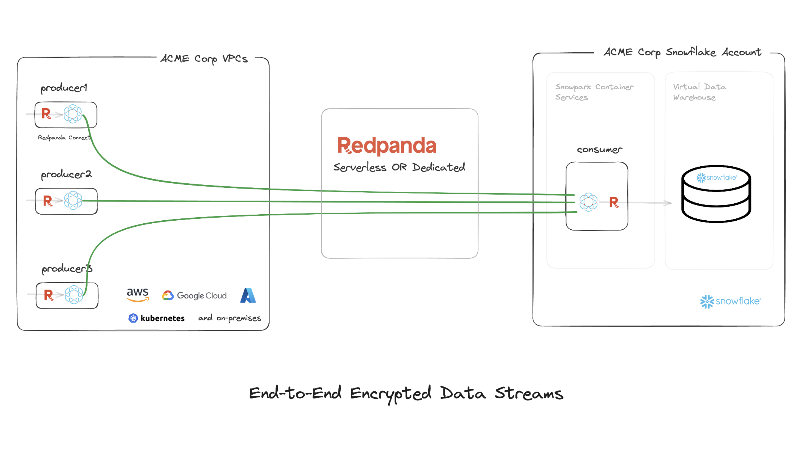

# End-to-End Encrypted Data Streams using Redpanda Serverless



## Setup Snowflake

```sql
USE ROLE ACCOUNTADMIN;

--Create Role
CREATE ROLE DATASTREAMS_ROLE;
GRANT ROLE DATASTREAMS_ROLE TO ROLE ACCOUNTADMIN;

--Create Database
CREATE DATABASE IF NOT EXISTS DATASTREAMS_DB;
GRANT OWNERSHIP ON DATABASE DATASTREAMS_DB TO ROLE DATASTREAMS_ROLE COPY CURRENT GRANTS;

--Create Warehouse
CREATE OR REPLACE WAREHOUSE DATASTREAMS_WH WITH WAREHOUSE_SIZE='X-SMALL';
GRANT USAGE ON WAREHOUSE DATASTREAMS_WH TO ROLE DATASTREAMS_ROLE;

--Create compute pool
CREATE COMPUTE POOL DATASTREAMS_CP
  MIN_NODES = 1
  MAX_NODES = 5
  INSTANCE_FAMILY = CPU_X64_XS;

GRANT USAGE ON COMPUTE POOL DATASTREAMS_CP TO ROLE DATASTREAMS_ROLE;
GRANT MONITOR ON COMPUTE POOL DATASTREAMS_CP TO ROLE DATASTREAMS_ROLE;

--Wait till compute pool is in idle or ready state
DESCRIBE COMPUTE POOL DATASTREAMS_CP;

--Create schema

CREATE SCHEMA IF NOT EXISTS DATASTREAMS_SCHEMA;
GRANT ALL PRIVILEGES ON SCHEMA DATASTREAMS_SCHEMA TO ROLE DATASTREAMS_ROLE;

--Create Image Repository
CREATE IMAGE REPOSITORY IF NOT EXISTS DATASTREAMS_REPOSITORY;
GRANT READ ON IMAGE REPOSITORY DATASTREAMS_REPOSITORY TO ROLE DATASTREAMS_ROLE;
--Note repository_url value to be used to build and publish consumer image to snowflake
SHOW IMAGE REPOSITORIES;
```

- Create table

```sql
USE ROLE DATASTREAMS_ROLE;
USE DATABASE DATASTREAMS_DB;
USE WAREHOUSE DATASTREAMS_WH;

CREATE or REPLACE TABLE DATASTREAMS_DB.DATASTREAMS_SCHEMA.KAFKA_MESSAGES (
	ID INTEGER,
	MESSAGE VARCHAR(256),
	EMAIL VARCHAR(256)
);

```

## Setup Redpanda

1. Create a Redpanda serverless cluster - https://cloud.redpanda.com/
2. Create a new topic with name `topic_A` with default settings.
3. Create a new user with name `tester`.
       - Select SCRAM-SHA-256 as SASL Mechanism and copy the password to use as environment variable below.
       - Navigate to Security->ACLs, select `tester`, select "Allow all operations"
4. Copy the following values to your shell's and set them as environment variables. `Bootstrap server url` can be found under _Overview->How to Connect-> Kafka API-> Configuration_


```sh
# Note down the values to be used later in the tutorial
export REDPANDA_BOOTSTRAP_SERVER="TODO:9092"
export REDPANDA_USERNAME="tester"
export REDPANDA_PASSWORD="TODO"
```

5. Extract full list of redpanda brokers

```sh
rpk cloud login
rpk cluster metadata -b
```

> You will see something similar to below.

```sh
# Sample output
ID    HOST                                                           PORT
0*    cpcdfmjconq6u97h0umg-0.0.us-east-1.mpx.prd.cloud.redpanda.com  9092
1     cpcdfmjconq6u97h0umg-1.0.us-east-1.mpx.prd.cloud.redpanda.com  9092
2     cpcdfmjconq6u97h0umg-2.0.us-east-1.mpx.prd.cloud.redpanda.com  9092

```

# Get started with Ockam

[Signup for Ockam](https://www.ockam.io/signup) and then run the following commands on your workstation:

```sh
# Install Ockam Command
curl --proto '=https' --tlsv1.2 -sSfL https://install.command.ockam.io | bash && source "$HOME/.ockam/env"

# Enroll with Ockam Orchestrator.
ockam enroll

# Create enrollment ticket for the node that will run inside container services.
ockam project ticket --usage-count 1 --expires-in 24h --attribute consumer --relay '*' > consumer.ticket

# Print the egress allow list for your Ockam project.
ockam project show --jq .egress_allow_list

```

## Build and Publish Redpanda Connect Consumer Image


```sh
cd redpanda_connect_consumer

docker login <repository_url>
docker build --rm --platform linux/amd64 -t <repository_url>/rp_connect_consumer .
docker push <repository_url>/rp_connect_consumer

```

## Setup Consumer in Snowpark

```sql

USE ROLE DATASTREAMS_ROLE;
USE DATABASE DATASTREAMS_DB;
USE WAREHOUSE DATASTREAMS_WH;
USE SCHEMA DATASTREAMS_SCHEMA;

--Update VALUE_LIST with ockam egress details
CREATE OR REPLACE NETWORK RULE OCKAM_OUT
TYPE = 'HOST_PORT' MODE= 'EGRESS'
VALUE_LIST = ("TODO:TODO","TODO:TODO");

-- Update below with `REDPANDA_BOOTSTRAP_SERVER` and the remaining with the output from `rpk cluster metadata -b`
CREATE OR REPLACE NETWORK RULE REDPANDA_OUT
TYPE = "HOST_PORT" MODE = "EGRESS"
VALUE_LIST = (
  'TODO_REDPANDA_BOOTSTRAP_SERVER:9092',
  'TODO_REDPANDA_SERVERLESS_ADDRESS_BROKER_0:9092',
  'TODO_REDPANDA_SERVERLESS_ADDRESS_BROKER_1:9092',
  'TODO_REDPANDA_SERVERLESS_ADDRESS_BROKER_2:9092'
);

CREATE OR REPLACE NETWORK RULE OCSP_OUT
TYPE = 'HOST_PORT' MODE= 'EGRESS'
VALUE_LIST = ('ocsp.snowflakecomputing.com:80');

-- Create access integration

USE ROLE ACCOUNTADMIN;
GRANT CREATE INTEGRATION ON ACCOUNT TO ROLE DATASTREAMS_ROLE;

CREATE OR REPLACE EXTERNAL ACCESS INTEGRATION OCKAM_REDPANDA
ALLOWED_NETWORK_RULES = (OCKAM_OUT, REDPANDA_OUT, OCSP_OUT)
ENABLED = true;

GRANT USAGE ON INTEGRATION OCKAM_REDPANDA TO ROLE DATASTREAMS_ROLE;

-- Create service
USE ROLE DATASTREAMS_ROLE;

DROP SERVICE IF EXISTS REDPANDA_CONNECT_OCKAM;

CREATE SERVICE REDPANDA_CONNECT_OCKAM
  IN COMPUTE POOL DATASTREAMS_CP
  FROM SPECIFICATION
$$
    spec:
      containers:
      - name: consumer
        image: /datastreams_db/datastreams_schema/datastreams_repository/rp_connect_consumer
        env:
          SNOWFLAKE_WAREHOUSE: DATASTREAMS_WH
          REDPANDA_BROKER: "TODO_SERVER:9092"
          REDPANDA_USERNAME: "tester"
          REDPANDA_PASSWORD: "TODO"
          OCKAM_ENROLLMENT_TICKET: "TODO"
$$
EXTERNAL_ACCESS_INTEGRATIONS = (OCKAM_REDPANDA)
MIN_INSTANCES=1
MAX_INSTANCES=1;

SHOW SERVICES;
SELECT SYSTEM$GET_SERVICE_STATUS('REDPANDA_CONNECT_OCKAM');
DESCRIBE SERVICE REDPANDA_CONNECT_OCKAM;
CALL SYSTEM$GET_SERVICE_LOGS('REDPANDA_CONNECT_OCKAM', '0', 'consumer', 1000);

```

## Run producer

```sh
# Use docker to run a producer to produce messages into redpanda
cd redpanda_connect_producer

OCKAM_ENROLLMENT_TICKET= \
docker run --rm \
  -v "$(pwd)/producer.yaml:/producer.yaml:ro" \
  -e OCKAM_ENROLLMENT_TICKET="$(ockam project ticket --usage-count 1 --expires-in 10m --attribute producer)"  \
  -e REDPANDA_BOOTSTRAP_SERVER="$REDPANDA_BOOTSTRAP_SERVER" \
  -e REDPANDA_USERNAME="$REDPANDA_USERNAME" \
  -e REDPANDA_PASSWORD="$REDPANDA_PASSWORD" \
  ghcr.io/build-trust/redpanda-connect --config /producer.yaml

```

## Verify data

```sql
SELECT * FROM DATASTREAMS_DB.DATASTREAMS_SCHEMA.KAFKA_MESSAGES;
```

## Cleanup

- Exit (Ctrl+C) from producer docker container

- Local files

```sh
rm consumer.ticket
```

- Snowflake objects

```sql
USE ROLE DATASTREAMS_ROLE;
USE DATABASE DATASTREAMS_DB;
USE WAREHOUSE DATASTREAMS_WH;
USE SCHEMA DATASTREAMS_SCHEMA;

DROP SERVICE IF EXISTS REDPANDA_CONNECT_OCKAM;

DROP NETWORK RULE IF EXISTS OCKAM_OUT;
DROP NETWORK RULE IF EXISTS REDPANDA_OUT;
DROP NETWORK RULE IF EXISTS OCSP_OUT;


USE ROLE ACCOUNTADMIN;

DROP INTEGRATION IF EXISTS OCKAM_REDPANDA;
DROP COMPUTE POOL IF EXISTS DATASTREAMS_CP;
DROP SCHEMA IF EXISTS DATASTREAMS_SCHEMA;
DROP WAREHOUSE IF EXISTS DATASTREAMS_WH;
DROP DATABASE IF EXISTS DATASTREAMS_DB;
DROP ROLE IF EXISTS DATASTREAMS_ROLE;

```
