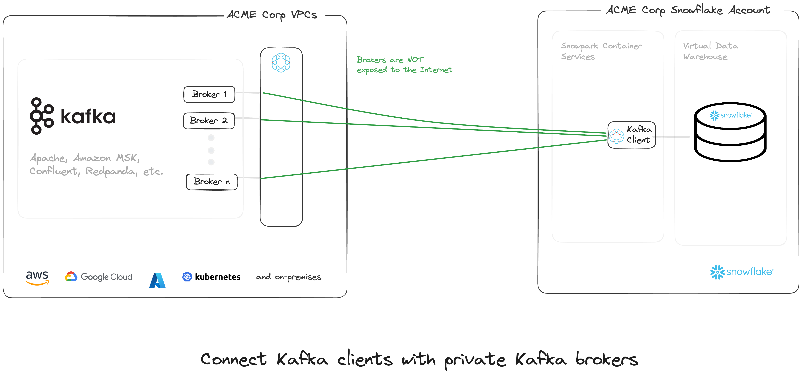

# Change Data Capture from Snowflake to Kafka



## Get started with Ockam

[Signup for Ockam](https://www.ockam.io/signup) and then run the following commands on your workstation:

```sh
# Install Ockam Command
curl --proto '=https' --tlsv1.2 -sSfL https://install.command.ockam.io | bash && source "$HOME/.ockam/env"

# Enroll with Ockam Orchestrator.
ockam enroll

# Create an enrollment ticket for the node that will run inside container services.
ockam project ticket --usage-count 1 --expires-in 10h --attribute snowflake-kafka-inlet > inlet.ticket
ockam project ticket --usage-count 1 --expires-in 10h --attribute snowflake-kafka-outlet --relay kafka > outlet.ticket
# Print the egress allow list for your Ockam project. You will use them later in the tutorial
ockam project show --jq .egress_allow_list

```
## Choose between creating an Amazon MSK vs Kafka cluster running on local machine

### Setup Amazon MSK, or

- Run Cloudformation template to create a private Amazon Managed Kafka cluster and an EC2 machine running ockam

```sh
cd amazon_msk
STACK_NAME=test-msk
ENROLLMENT_TICKET="$(cat ../outlet.ticket)"

aws cloudformation create-stack \
    --region us-west-1 \
    --stack-name $STACK_NAME \
    --template-body file://./msk-private-cluster.yaml \
    --parameters ParameterKey=EnrollmentTicket,ParameterValue=$ENROLLMENT_TICKET \
    --capabilities CAPABILITY_IAM

cd -
```

### Setup Apache Kafka with Ockam

- Start Local Apache Kafka Server with Ockam

```sh
echo; pushd docker_kafka; ENROLLMENT_TICKET=$(cat ../outlet.ticket) docker compose up ; popd
```

- View console at http://localhost:8080/

## Setup Snowflake

Snowflake tables and objects

```sql

USE ROLE ACCOUNTADMIN;

-- CREATE ROLES
CREATE OR REPLACE ROLE CDC_TEST_ROLE;

-- CREATE DATABASE
CREATE DATABASE IF NOT EXISTS CDC_TEST_DB;

-- CREATE WAREHOUSE
CREATE OR REPLACE WAREHOUSE CDC_TEST_WH WITH WAREHOUSE_SIZE='X-SMALL';

-- CREATE SCHEMA
CREATE SCHEMA IF NOT EXISTS CDC_TEST_SCHEMA;

-- CREATE COMPUTE POOL
CREATE COMPUTE POOL CDC_TEST_CP
  MIN_NODES = 1
  MAX_NODES = 5
  INSTANCE_FAMILY = CPU_X64_XS;

-- WAIT
DESCRIBE COMPUTE POOL CDC_TEST_CP;

-- CREATE IMAGE REPOSITORY
CREATE IMAGE REPOSITORY IF NOT EXISTS CDC_TEST_REPO;

-- Note repository_url value to be used to build and publish consumer image to snowflake
SHOW IMAGE REPOSITORIES;

-- GRANTS
GRANT ROLE CDC_TEST_ROLE TO ROLE ACCOUNTADMIN;
GRANT ALL ON DATABASE CDC_TEST_DB TO ROLE CDC_TEST_ROLE;
GRANT ALL ON WAREHOUSE CDC_TEST_WH TO ROLE CDC_TEST_ROLE;
GRANT ALL ON SCHEMA CDC_TEST_SCHEMA TO ROLE CDC_TEST_ROLE;
GRANT ALL ON COMPUTE POOL CDC_TEST_CP TO ROLE CDC_TEST_ROLE;
GRANT READ ON IMAGE REPOSITORY CDC_TEST_REPO TO ROLE CDC_TEST_ROLE;
GRANT CREATE INTEGRATION ON ACCOUNT TO ROLE CDC_TEST_ROLE;


USE ROLE CDC_TEST_ROLE;
USE DATABASE CDC_TEST_DB;
USE WAREHOUSE CDC_TEST_WH;
USE SCHEMA CDC_TEST_SCHEMA;

-- CREATE TABLE
CREATE OR REPLACE TABLE CDC_TEST_TABLE (
    KEY VARCHAR(256),
    VALUE VARCHAR(256)
);
GRANT ALL ON TABLE CDC_TEST_TABLE TO ROLE CDC_TEST_ROLE;

-- CREATE STREAM
CREATE OR REPLACE STREAM CDC_TEST_TABLE_STREAM ON TABLE CDC_TEST_TABLE;
GRANT ALL ON STREAM CDC_TEST_TABLE_STREAM TO ROLE CDC_TEST_ROLE;

```

## Build and push Python application Image


```sh
cd snowflake_cdc_publisher

# Use the value of the repository_url from SHOW IMAGE REPOSITORIES command
docker login <repository_url>
docker build --rm --platform linux/amd64 -t <repository_url>/snowflake_cdc_kafka_bridge .
docker push <repository_url>/snowflake_cdc_kafka_bridge

cd -
```

## Deploy Snowflake CDC Publisher with Ockam in Snowpark Container services

> [!IMPORTANT]
> Replace `TODO` values in `VALUE_LIST` with the output of `ockam project show --jq .egress_allow_list` command in previous step.

```sh
#Example
VALUE_LIST = ("k8s-XXX.amazonaws.com:4XXX","k8s-XXX.amazonaws.com:4XXX");
```

> [!IMPORTANT]
> Replace `<OCKAM_ENROLLMENT_TICKET>` with the contents of `inlet.ticket` generated in previous step

```sql

USE ROLE CDC_TEST_ROLE;
USE DATABASE CDC_TEST_DB;
USE WAREHOUSE CDC_TEST_WH;
USE SCHEMA CDC_TEST_SCHEMA;

CREATE OR REPLACE NETWORK RULE CDC_TEST_OSCP_OUT
TYPE = 'HOST_PORT' MODE= 'EGRESS'
VALUE_LIST = ('ocsp.snowflakecomputing.com:80');


-- Update VALUE_LIST with ockam egress details
CREATE NETWORK RULE CDC_TEST_OCKAM_OUT TYPE = 'HOST_PORT' MODE = 'EGRESS'
VALUE_LIST = ('TODO:TODO', 'TODO:TODO');


-- Create access integration
USE ROLE ACCOUNTADMIN;

CREATE OR REPLACE EXTERNAL ACCESS INTEGRATION CDC_TEST_EXTERNAL_ACCESS_INT
ALLOWED_NETWORK_RULES = (CDC_TEST_OSCP_OUT, CDC_TEST_OCKAM_OUT)
ENABLED = true;

GRANT USAGE ON INTEGRATION CDC_TEST_EXTERNAL_ACCESS_INT TO ROLE CDC_TEST_ROLE;

-- Create service
USE ROLE CDC_TEST_ROLE;

DROP SERVICE IF EXISTS SNOWFLAKE_CDC_KAFKA_BRIDGE;

CREATE SERVICE SNOWFLAKE_CDC_KAFKA_BRIDGE
  IN COMPUTE POOL CDC_TEST_CP
  FROM SPECIFICATION
$$
    spec:
      containers:
      - name: publisher
        image: /cdc_test_db/cdc_test_schema/cdc_test_repo/snowflake_cdc_kafka_bridge
        env:
          STREAM_NAME: CDC_TEST_DB.CDC_TEST_SCHEMA.CDC_TEST_TABLE_STREAM
          KAFKA_BOOTSTRAP_SERVERS: 127.0.0.1:9092
          KAFKA_TOPIC_NAME: test-topic
          SNOWFLAKE_WAREHOUSE: CDC_TEST_WH
          JOB_SUCCESS_SLEEP_TIME: 30
          JOB_ERROR_SLEEP_TIME: 60
          OCKAM_DISABLE_UPGRADE_CHECK: true
          OCKAM_OPENTELEMETRY_EXPORT: false
          ENROLLMENT_TICKET: "<OCKAM_ENROLLMENT_TICKET>"
$$
EXTERNAL_ACCESS_INTEGRATIONS = (CDC_TEST_EXTERNAL_ACCESS_INT)
MIN_INSTANCES=1
MAX_INSTANCES=1;

SHOW SERVICES;
SELECT SYSTEM$GET_SERVICE_STATUS('SNOWFLAKE_CDC_KAFKA_BRIDGE');
DESCRIBE SERVICE SNOWFLAKE_CDC_KAFKA_BRIDGE;
CALL SYSTEM$GET_SERVICE_LOGS('SNOWFLAKE_CDC_KAFKA_BRIDGE', '0', 'publisher', 1000);
-- Client runs every 30 seconds and pick up changes from CDC_TEST_TABLE_STREAM
```

Upon kafka client successfully connecting to Kafka server, you will see `INFO - Kafka producer created successfully` in the logs

## Update table and verify

```sql
-- Insert records
INSERT INTO CDC_TEST_TABLE
SELECT UUID_STRING(), randstr(255, RANDOM())
FROM TABLE(GENERATOR(ROWCOUNT => 100));

-- Verify Test Table and CDC Table
SELECT * FROM CDC_TEST_TABLE;
SELECT * FROM CDC_TEST_TABLE_STREAM;

-- Publisher checks for changes every 30 seconds. Looks at logs and check that changes have been published
CALL SYSTEM$GET_SERVICE_LOGS('SNOWFLAKE_CDC_KAFKA_BRIDGE', '0', 'publisher', 100);

```
- Check for service log messages indicating successful delivery of changes to kafka

```sh
# Sample logs
...
2024-07-02 XXX - INFO - Found 100 changes in stream CDC_TEST_DB.CDC_TEST_SCHEMA.CDC_TEST_TABLE_STREAM
2024-07-02 XXX - INFO - Successfully queued 100 changes for Kafka topic test-topic
2024-07-02 XXX - INFO - Message delivered to test-topic [partition: 0] at offset 0
...

```
- Make few more changes

```sql
-- Insert, Update and Delete
INSERT INTO CDC_TEST_TABLE (key, value) VALUES
('key1', 'value1');

UPDATE CDC_TEST_TABLE SET value = 'updated_value1' WHERE key = 'key1';

-- Clear existing data
TRUNCATE TABLE CDC_TEST_TABLE;

```

- View messages in Kafka server
  - Local Kafka messages can be viewed at http://localhost:8080

- View messages in Amazon MSK
    - Select the region you have deployed the Cloudformation stack to.
    - Obtain the `Bootstrap server address` from Amazon MSK -> Clusters -> `PrivateMSKCluster` -> View Client Information.
    - Connect to EC2 machine named `MSK-Client-Instance` via Session Manager and run below commands to view messages.
  ```sh
   sudo su
   # Replace TODO with the bootstrap server address obtained in previous step
   export BOOTSTRAP_SERVERS="TODO"
   /opt/kafka_2.13-3.5.1/bin/kafka-console-consumer.sh --bootstrap-server $BOOTSTRAP_SERVERS --topic test-topic --from-beginning
   # You can make further changes to the table and see the messages appear in ~30 seconds
  ```

# Cleanup

- AWS MSK

```sh
cd amazon_msk
STACK_NAME=test-msk
aws cloudformation delete-stack --stack-name $STACK_NAME --region us-west-1
cd -
```
- Local machine

```sh
rm inlet.ticket outlet.ticket
```

```sh
# Run if a local cluster was created
pushd docker_kafka; docker compose down --rmi all --remove-orphans; popd
```

- Snowflake
```sql
USE ROLE CDC_TEST_ROLE;
USE DATABASE CDC_TEST_DB;
USE WAREHOUSE CDC_TEST_WH;
USE SCHEMA CDC_TEST_SCHEMA;

DROP SERVICE IF EXISTS SNOWFLAKE_CDC_KAFKA_BRIDGE;
DROP TABLE CDC_TEST_TABLE;
DROP STREAM CDC_TEST_TABLE_STREAM;

USE ROLE ACCOUNTADMIN;

DROP NETWORK RULE IF EXISTS CDC_TEST_OSCP_OUT;
DROP NETWORK RULE IF EXISTS CDC_TEST_OCKAM_OUT;
DROP INTEGRATION IF EXISTS CDC_TEST_EXTERNAL_ACCESS_INT;
DROP COMPUTE POOL IF EXISTS CDC_TEST_CP;
DROP SCHEMA IF EXISTS CDC_TEST_SCHEMA;
DROP WAREHOUSE IF EXISTS CDC_TEST_WH;
DROP DATABASE IF EXISTS CDC_TEST_DB;
DROP ROLE IF EXISTS CDC_TEST_ROLE;
```
