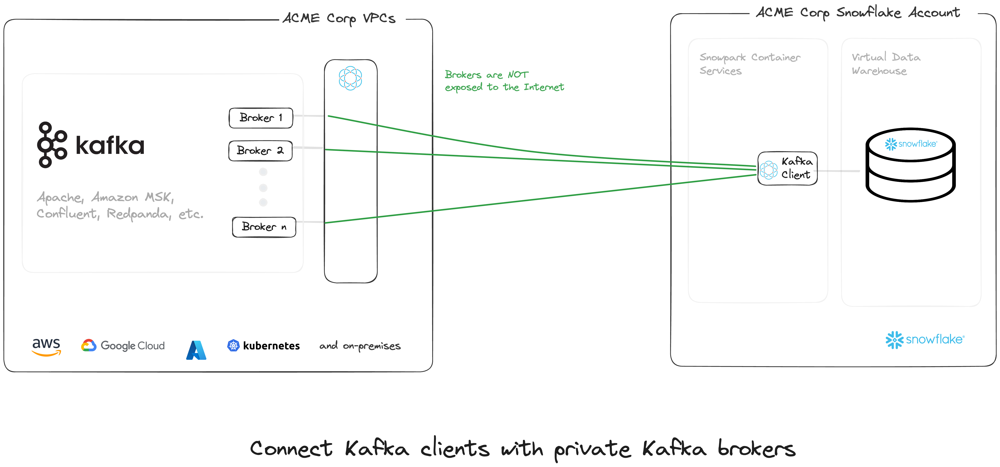

# Use the Ockam node Snowflake application to connect to a private Postgres database



This example shows how to use the Ockam node Snowflake application to query a private Postgres database.

We will:

1. Create a Snowflake test environment and role.
1. Start a Postgres database locally with an Ockam TCP outlet node.
1. Instantiate the Ockam node Snowflake application to access the TCP outlet via a relay.
1. Deploy a Snowflake application with a Postgres client accessing the database as if it was colocated inside Snowflake.
1. Show that we can select data from the private database and insert it into a Snowflake table.

## Prerequisites

In order to run this example you need to install the following:

- Ockam,
  with `curl --proto '=https' --tlsv1.2 -sSfL https://install.command.ockam.io | bash && source "$HOME/.ockam/env"`.
- [Postgres](https://www.postgresql.org/download/).
- [Docker](https://docs.docker.com/get-docker).
- [Snowflake-cli](https://docs.snowflake.com/en/developer-guide/snowflake-cli-v2/installation/installation).
- `envsubst` (via the `gettext` package on [Mac](https://formulae.brew.sh/formula/gettext),
  and [Linux](https://www.gnu.org/software/gettext/gettext.html)).

## Get started with Ockam

[Signup for Ockam](https://www.ockam.io/signup) and then run the following commands on your workstation:

```sh
# Enroll with Ockam Orchestrator.
ockam enroll

# Create an enrollment ticket for the node that will run inside the native application.
export CLIENT_TICKET="$(ockam project ticket --usage-count 1 --expires-in 1h --attribute postgres_client)"

# Create an enrollment ticket for the node that will run alongside the private Postgres database.
export SERVER_TICKET="$(ockam project ticket --usage-count 1 --expires-in 1h --attribute postgres_server --relay postgres)"

# Print the egress allow list for the Ockam project. You will use them later in this example.
export EGRESS_ALLOW_LIST="$(ockam project show --jq .egress_allow_list | sed "s/\"/'/g" | sed "s/\[/(/g" | sed "s/\]/)/g")"
```

## Create a test database

You can create the database and grants required to run the example by running the `consumer.sql` script.
You have first to export your Snowflake user name so that the `consumer_role` used for the example gets granted to your
user.

```
export USER_NAME=<your user name here>

cat ./consumer.sql | envsubst | snow sql --stdin
```

## Start a private Postgres database with an Ockam TCP outlet

Start a Postgres server and an Ockam TCP outlet with:

```shell
docker compose -f ./docker_postgres/docker-compose.yml up
```

This now makes the database running locally accessible via a relay named `postgres` on your Ockam project.

## Instantiate the Ockam node Snowflake application

TODO

## Build and deploy the Postgres client application

The native application uses a Docker image starting an Ockam node:

```
docker build --rm --platform linux/amd64 -t postgres_client ./application/postgres_client 
```

Then we publish this image to the Snowflake image repository created in the previous section.
First, we get the repository URL:

```sh
# Login
snow spcs image-registry login

# Get the repository URL
export REPOSITORY_URL="$(snow spcs image-repository url consumer_database.consumer_schema.consumer_repository --role consumer)"
```

We tag the image with the repository URL:

```shell
docker tag postgres_client $REPOSITORY_URL/postgres_client
```

We push the image to the repository:

```shell
docker push $REPOSITORY_URL/postgres_client
```

We can run the following command to confirm that the image has been correctly uploaded:

```shell
snow spcs image-repository list-images customer_database.customer_schema.customer_repository --role customer
```

## Deploy the application

Now we can deploy and instantiate the application:

```shell
snow app run --project ./application
```

If that step is successful you should see a message like:

```shell
Your application object (postgres_client) is now available:
https://app.snowflake.com/HYCWVDM/ekb57526/#/apps/application/POSTGRES_CLIENT
```

Note that you can use the `restart.sh` script to re-run the build + push + start steps if you are modifying
the `postgres_client` application.

## Test the application
