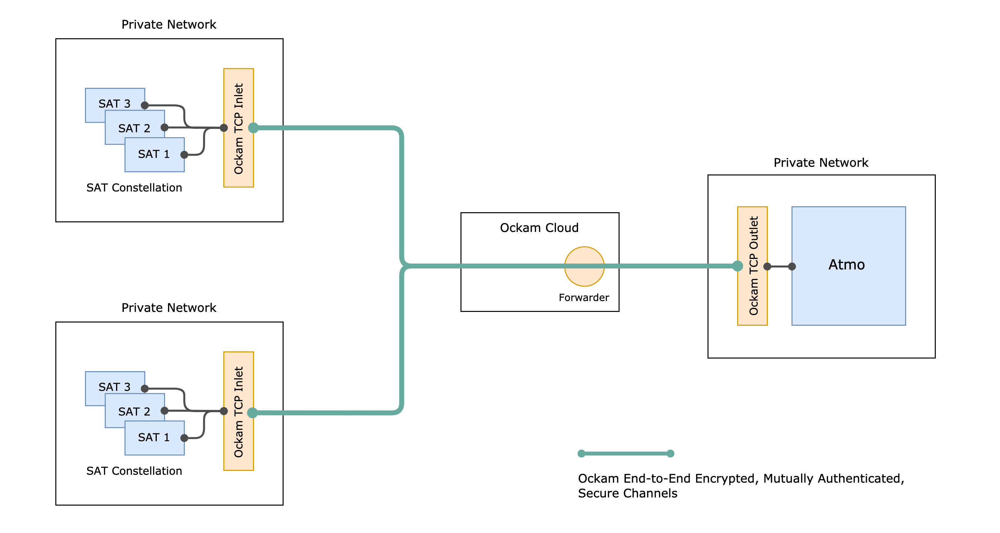

# Suborbital and Ockam

<p></p>

This integration is a reference design for a secure-by-default edge computing network using
[Suborbital's](https://suborbital.dev) WebAssembly-based server application environment and
[Ockam's](https://github.com/build-trust/ockam) end-to-end encrypted communication channels.

The WebAssembly sandbox and [trustful communication](https://github.com/build-trust/ockam#readme)
provided by Ockam, make it simple to deploy edge computing infrastructure that protects user
data in transit and curbs security incidents caused by malicious code or supply-chain attacks.

As you can see in the diagram above, this example involves a webserver
([Atmo-proxy](https://github.com/suborbital/atmo)) deployed on a cloud instance, and an edge
compute server ([Sat](https://github.com/suborbital/sat)) deployed anywhere in the world
(such as home computers, Raspberry Pis, etc). HTTP traffic is received by the webserver, shuttled
over an Ockam [end-to-end secure channel](e2ee-secure-channels) to the Sat instance, and handled
by the WebAssembly function it has loaded.

## 1. Setup

To deploy this reference design you'll need Docker and the
[Subo CLI](https://github.com/suborbital/subo).

If you use macOS, you can use Homebrew to install the `subo` command line tool:

```bash
brew tap suborbital/subo
brew install subo
```

To install on Linux (or macOS without Homebrew), visit the
[Subo repository](https://github.com/suborbital/subo/releases).

Then, run `subo --version` to ensure the installation was successful.

## 2. Build the WebAssembly function

The source code for the `helloworld-rs` function is included in this directory.
To build it, use `Subo`:

```bash
git clone https://github.com/build-trust/ockam

cd ockam/integrations/suborbital
subo build .
```

Subo will use a Docker-based builder to compile the Rust serverless function into WebAssembly
and create all of the artifacts needed to run this application.

## 3. Start Atmo-proxy and Ockam TCP Outlet

This component is ideally deployed on a cloud instance such as a DigitalOcean droplet or
Google Cloud Virtual Machine, but can be done on your local machine.

```bash
docker-compose -f docker-compose-ockam-tcp-outlet-atmo.yaml up
```

This will print a `FORWARDING_ADDRESS` for this outlet in Ockam Cloud. Copy it.

Atmo-proxy will begin listening for requests on port `8080`

## 4. Start Ockam TCP Inlet and Sat

You can now start the Sat edge compute server on any machine, and Ockam end-to-end encrypted
and authenticated secure channels will automatically be created to link the components,
even if they are running in isolated private networks.

You don't have to expose any ports from the edge network or worry about NAT traversal, discovery etc.
This is done using Ockam Cloud that relays end-to-end encrypted traffic and enable mutual discovery,
authentication and authorization.

Replace `FWD_05ea353a2d7b8261` here with address from step 3.

```
FORWARDING_ADDRESS=FWD_05ea353a2d7b8261 docker-compose -f docker-compose-ockam-tcp-inlet-sat.yaml up
```

Send a request to the `Atmo-proxy` server:

```bash
curl -d "my friend" {atmo-proxy-address}:8080/hello
hello, my friend
```

If you're trying this on your laptop `{atmo-proxy-address}` will be `127.0.0.1`.

You have now successfully deployed an end-to-end encrypted and sandboxed edge compute network!

The result is a distributed, flexible and scalable compute cluster that guarantees the privacy and
security of your application. WebAssembly executes your code in a sandbox that dynamically grants
access to resources like databases and caches. Atmo and Sat handle the sandbox, runtime, and scaling
of serverless functions while Ockam’s Secure Channels maintain trustful communication in the networking
fabric that connects them.

<div>
<hr>
<b>Next:</b> Learn more about <a href="https://github.com/build-trust/ockam#next-steps">Ockam</a> and <a href="https://suborbital.dev/atmo">Suborbital</a>.
</div>

[e2ee-secure-channels]: https://github.com/build-trust/ockam/tree/develop/documentation/use-cases/end-to-end-encrypt-all-application-layer-communication#readme
